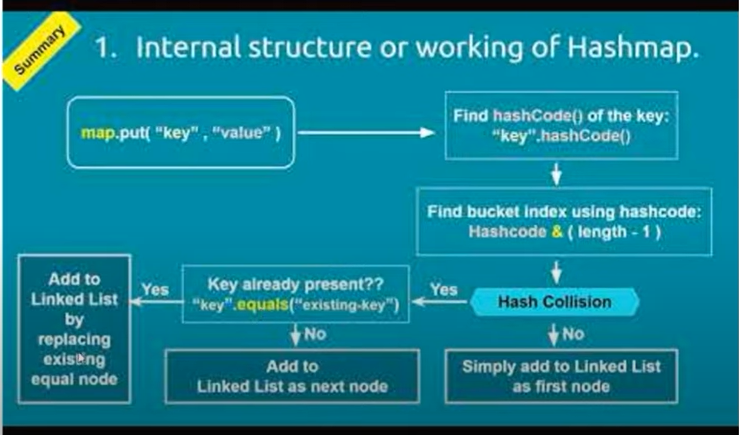
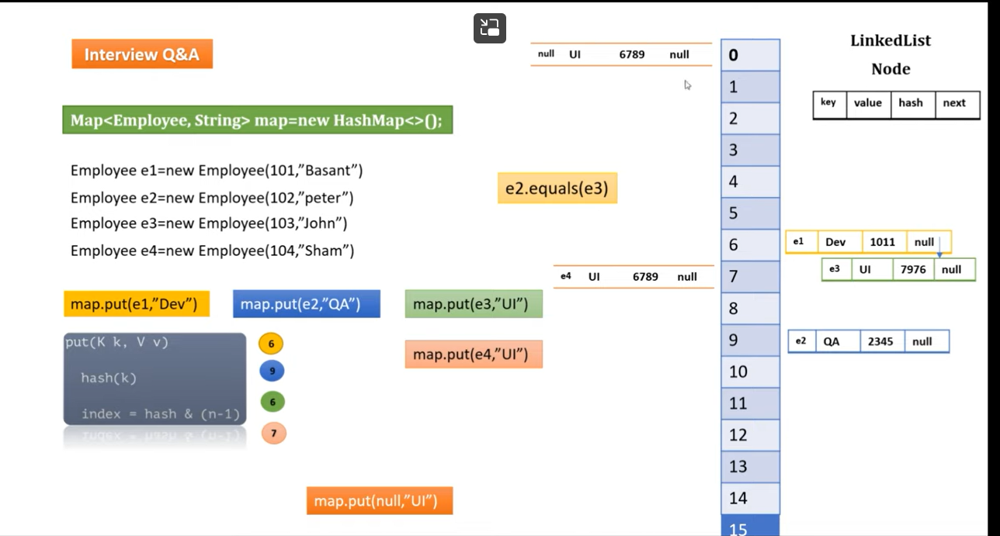

1) Iterable
2) Collection
3) Set
   a) Set : <- AbstractSet <- HashSet <- LinkedHashSet
   b) Set : <- SortedSet <- NavigableSet <- TreeSet
   c) Set : <- AbstractSet <- TreeSet
4) Queue
   a) Queue : <- Deque <- LinkedList
   b) Queue : <- AbstractQueue <- PriorityQueue
5) List
   a) List : <- AbstractList <- ArrayList
   b) List : <- AbstractList <- Vector <- Stack
   c) List : <- AbstractList <- AbstractSequentialList <- LinkedList
6) Map
   a) Map : <- AbstractMap <- HashMap <- LinkedHashMap
   b) Map : <- AbstractMap <- TreeMap
   c) Map : <- SortedMap <- NavigableMap <- TreeMap
   d) Map,Dictionary : <- HashTable <- Properties
        
Interfaces : Iterable , Collection , Set , List , Queue , SortedSet , NavigableSet , Deque
Abstract Classes : AbstractSet , AbstractList, AbstractSequentialList , AbstractQueue
Concrete Class(Implementation) : HashSet , LinkedHashSet , TreeSet , ArrayList , Vector , LinkedList , PriorityQueue

For Map everything is same as Set.

====================================================================

1#
Set
-> Doesn't allow duplicates
-> Unordered collection
-> Some Implementation classes are :- HashSet, LinkedHashSet, TreeSet and AbstractSet.

-------------------------------

Extended Interfaces:-
SortedSet
-> This interface extends Set and provides a total ordering of its elements.
-> All elements of a SortedSet must implement the Comparable interface (or be accepted by the specified Comparator).
-> Some Methods are :- comparator() , first() , last() , headSet(E toObj) , tailSet(E fromObj) , subSet(E fromObj, E toObj)

NavigableSet
-> NavigableSet interface inherits from the SortedSet interface.
-> It behaves like a SortedSet with additional navigation methods.
-> Some methods are :- Lower(E e) , Higher(E e) , Floor(E e ) , Ceiling(E e) , pollFirst() , pollLast()

-------------------------------

Implementation Classes:-
HashSet
Internally  : HashSet internally uses HashMap for storing objects
Uses	    : Use if you don’t want to maintain insertion order
Performance : HashSet performance is better according to LinkedHashSet and TreeSet.
Compare	    : HashSet uses equals() and hashCode() methods to compare the objects
Null	    : HashSet allows only one null objects
Thread Safe : No

LinkedHashSet
Internally  : LinkedHashSet uses LinkedHashMap internally to store objects
Uses	    : Use if you want to maintain insertion order
Performance : The performance of LinkedHashSet is slow to HashSet, because LinkedHashSet maintains LinkedList internally to maintain the insertion order. The performance of LinkedHashSet is better to TreeSet in case of insertion and removal of element.
Compare	    : LinkedHashSet uses equals() and hashCode() methods to compare it’s objects
Null	    : LinkedHashSet allows only one null objects
Thread Safe : No

TreeSet
Internally  : TreeSet uses TreeMap internally to store objects
Uses	    : Use if you want to sort the elements according to some Comparator
Performance : TreeSet performance is better to LinkedHashSet, EXCLUDING insertion and removal operations because, it has to sort the elements after each insertion and removal operations.
Compare	    : TreeSet uses compare() and compareTo() methods to compare the objects
Null	    : TreeSet not allow a any null objects. If you insert null objects into TreeSet, it throws NullPointerException.
Thread Safe : No

====================================================================

2#
List
-> Duplicate values can be stored
-> Ordered collection
-> Preserves the insertion order
-> It allows positional access and insertion of elements
-> Some Implementation Classes are :- ArrayList , Vector , LinkList , Stack

-------------------------------

ArrayList Vs Vector

ArrayList
Synchronization : ArrayList is not synchronized, which means multiple threads can work on arrayList at the same time.
Use	        : If resource(arraylist) is not shared between threads.
Performance     : ArrayList is faster, since it is non-synchronized(so works asynchronously)
Thread Safe     : No
Data Growth     : ArrayList grow and shrink dynamically. ArrayList increments 50% of the size if elements exceeds its capacity.
Traversal       : ArrayList can only use Iterator for traversing.

Vector   
Synchronization : Vector is synchronized, which means only one thread can work on arrayList at the same time.
Use	        : If resource(arraylist) are to be shared between threads.
Performance     : Vector is slower, since it is synchronized(so works one after another)
Thread Safe     : Yes
Data Growth     : Vector grow and shrink dynamically, while vector increments 100% – essentially doubling the current array size.
Traversal       : Vector can use both Enumeration and Iterator for traversing over elements of vector.

-------------------------------

ArrayList Vs LinkedList

ArrayList
1) Internally   : Implemented with the concept of dynamic array.
2) Modify       : Insertions and Deletion are easy but slower than LinkedList.
   Reason:
   -> Bcz of risk of resizing array and copying content to new array if array gets full 		
   -> It also maintains its index
3) Accessing    : Arraylist is faster in accessing element (ie get and set), because element can be accessed directly using index.
4) Memory Space : ArrayList has less memory overhead than LinkedList.

LinkedList
1) Internally   : Implemented with the concept of doubly linked list.
2) Modify       : Insertions and Deletion are easy and fast in LinkedList.
   Reason:-
   -> No Risk of resizing and copying content again
   -> no need to maintain index
3) Accessing    : LinkedList is slower is accessing element bcz it has to traverse from head node to target node in link list.
4) Memory Space : LinkedList has more memory overhead than ArrayList because in ArrayList each index only holds actual object (data) but in case of LinkedList each node holds both data and address of next and previous node.

====================================================================

3#
Queue
-> Ordered list
-> Used to hold the elements about to be processed
-> Insert elements at the end of the list and deleting elements from the start of list i.e. it follows the FIFO
-> Some Implementations Classes are :- LinkedList , PriorityQueue , PriorityBlockingQueue , ArrayBlockingQueue , LinkedBlockingQueue
-> Difference is BlockingQueue are Thread Safe Implementation and others are not.

Can we insert null into Queue?
-> No, we can't insert null into queue.
-> PriorityQueue implementation doesn't allow null value to be inserted.
-> But LinkedList implementation allows null value to be inserted, which is also implementation of Queue.
-> As per documents :-
If some implementation of Queue allows null to be inserted, then also we should try to not insert null as an element.
This is bcz if we use poll() method on queue it will return null if queue is empty,
so we will not get to know whether its bcz of Queue being empty or its an element.

Difference between Queue in "java.util" and "java.util.concurrent" package?
-> Queue in java.util are Unbounded queue
-> Queue in java.util.concurrent are Bounded Queue.
-> Bounded means which is bounded to some capacity, once created cannot modify size, if gets full goes into blocking state.

Difference between ArrayBlockingQueue and LinkedBlockingQueue?
-> ArrayBlockingQueue is Bounded queue
-> LinkedBlockingQueue is optionally Bounded queue (means can be Bounded or UnBounded)
-> A.B.Q. is backed by array, it is bounded so once created we cannot modify its size.
-> L.B.Q is backed by linked nodes, it is optionally bounded so we can modify size using it's constructor bound argument.

PriorityQueue
-> Used when the objects are supposed to be processed based on the priority.
-> Queue follows FIFO, but sometimes elements are to be processed based on priority, thats where priority queue comes in picture.
-> Insertion is done at end && removal is based on element priority.
-> Elements preserve natural ordering or can be according to comparator(is used).
-> Not allow null, Not Thread Safe , Bounded Queue

LinkedList
-> Elements are not stored in contiguous locations
-> Every element is a separate object with a data part and address part.
-> Due to ease of insertions and deletions, they are preferred over the arrays.
-> Disadvantages:- The nodes cannot be accessed directly instead we need to start from head and traverse to node we want to access.
-> Implementation of List and Deque interfaces.

====================================================================

4#
Map
-> A Map cannot contain duplicate keys and each key can map to at most one value.
-> Used where we need key-value pair.
-> Elements retrieval and updatation is done by using keys(key is used to access value associated with it).
-> Allow null key and null value in HashMap and LinkedHashMap, but not in TreeMap.
-> Some implementation classes are :- HasMap , LinkedHashMap , TreeMap.
-> LinkedHashMap and TreeMap are ordered but HashMap is Unordered.

---------------------------------

HashMap | TreeMap | LinkedHashMap | HashTable

Similarities
-> Access         : HashMap contains values based on keys
-> Unique         : HashMap contains only unique elements.

Differences
HashMap
-> Implementation : Implemented by an array of linked lists(List of Buckets).
-> Null           : HashMap may have one null key and multiple null values.
-> Order          : HashMap maintains no order.
-> Synchronized   : No [use Collections.synchronizedMap()]
-> Data Structure : [HashTable] ie List of Buckets (if more than 8 entries in bucket then java8 will switch it to Balanced Tree).
-> Req for keys	  : equals() and hashcode() needs to be overridden.

LinkedHashMap
-> Implementation : Doubly Linked List of Buckets
-> Null           : Same
-> Order          : Maintains insertion order.
-> Synchronized   : No
-> Data Structure : [HashTable & Linked List] ie Linked List of Buckets(Linked list is of doubly type)
-> Req for keys	  : equals() and hashcode() needs to be overridden.

TreeMap
-> Implementation : Implemented by Red Black Tree
-> Null           : No null key but multiple null values
-> Order          : Maintains ascending order(Either Sorted using the natural order of its key OR using Comparator).
-> Synchronized   : No
-> Data Structure : Red Black Tree, a kind of self balancing BST(binary search tree), implementation of binary tree.
-> Req for keys	  : Comparator needs to be supplied for keys implementation
otherwise natural order is used to sort (and for that key class must implement comparable).

HashTable (Generic name for hash based Maps)
-> Implementation : A Hashtable is an array of list. Each list is known as a bucket.
-> Null           : It may have not have any null key or value.
-> Order          : Maintains no order.
-> Synchronized   : Yes
-> Data Structure : Array of list
-> Req for keys   : equals() and hashcode() needs to be overridden.

Conslusion:
1) LisnkedHashMap is same as HashMap but maintains insertion order.
2) TreeMap is same as HashMap but
   a) maintains natural key order(or key order using comparator) and
   b) doesnot allow null key

3) HashTable is same as HasMap but
   a) its syncronized.
   b) donot have null key or value
-----------------------------------------------------------------------------------------------------------------
#1. Internal Working of HashMap
   - Internal working of put() method
# each bucket contains a LinkedList, each LinkedList contains Nodes, each Node contains |key|,|value|,|hash|,|next|
when we create Hashmap Object internally it creates buckets of default size=16(index from 0-15).
when I call put method to insert object into map then internally it call the hashcode(k) method and calculate hashcode
of the key and then it calculate the index by index = hash(key) & (n-1) and then based on index number the node store.
- same for the nex element.
Hash Collision : let suppose the index number evaluated same of two node then it is called hash collision.
  - and this time it internally call equals method to check the key if it return true and it replace the node, 
  - if it return false then it add the node as next element.
  - null key always saved into 0th index.
       
   

#2 Java 8 enhancements in Hashmap
In Java 8, HashMap replaces the linked list with another useful data structure i.e. binary tree on breaching a certain threshold,
which is known as TREEIFY_THRESHOLD. Once this threshold is reached the linked list of Entries is converted to the TreeNodes
which reduces the time complexity from O(n) to O(log(n)).
TreeNodes are nothing but the structures supporting the binary trees which have two nodes, smaller node goes to the left and the larger to the right.
Whenever we want to search for any key the whole left or right subtree is discarded with a single check.
This is how the time complexity is reduced to O(log(n). This change has lead to a significant improvement of HashMap.
Once the number of entries is decreased due to removal or resizing of HashMap, the structure is converted back to the older implementation
which is LinkedList.

#3. ConCurrent Hashmap vs Synchronized HashMap
- This is thread safe it means multiple threads can perform action at the same time without any issue.
- Concurrent HashMap contains 16 segment and each segment is independent block.
- so whenever any modifiy operation apply on any of the segment it allow to modify easily without throwing any exception. because the lock apply
  on each segment seperetly not on the entire bucket like Hashmap.
  Reference : https://www.javainuse.com/java/javaConcurrentHashMap

-> Hashmap
- Its a syncronised hashmap at a time only one thread can perform action.
- Hashmap size is 16 which is not the independent block.
- so whenever any modification operation happens it will throw concurrent modification exception bcz lock is applied on entire hashmap.

#4. Complexity
List.add()  - O(1)
List.get()  - O(1)
List.remove()  - O(n)
- List if faster in Fetching elements
- List is slower in insertion & Deletion [Bcz of resizing of Array when default size get full]
   ---------------------
LinkedList.add()  - O(1)
LinkedList.get()  - O(n)
LinkedList.remove()  - O(n)
- LinkedList faster in insertion & Deletion
- LinkedList is slower in Fetching elements [bcz need to traverse each node]

