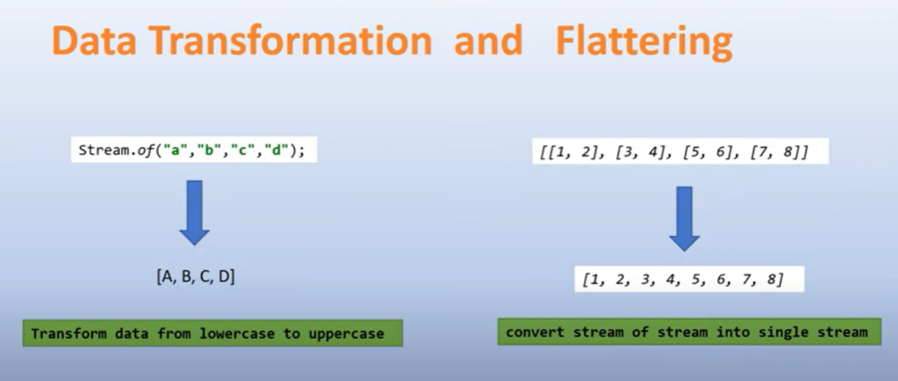

Ref # JavaTechie-Youtube
# FUNCTIONAL INTERFACE
    The interface who contains only one abstract method but can have multiple default & static
    method. called functional interface.
    Example-
    Runnable    : run()
    Callable    : call()
    Comparable  : compareTo()
    Comparator  : compare()

# LAMBDA EXPRESSION
    To implement the functional interface methods.in annonymus method way.
    Advantages : 1.Remove the boilerplate code, 2.To reduce the code length. bcz in traditional way we need to implement
    the interface and have to override in the class.
    Example : () ->System.out.println("Hi");
              (a) ->System.out.println("sum is:"+a);
              Calculator calc = (a,b)->a-b;
                System.out.println(calc.subtract(10,5);
    Example : sort Employee object based on name, here we will use Comparator using lambda expression
    Collections.sort(emp,(e1,e2)->e1.getName().compareTo(e2.getName)
#Traditionally we need to implement the interface, then override the method with body and nos of line code, and then need
to call the method manually. the whole things removed in using lambda expression in a single line and less code

# IN BUILD FUNCTIONAL INTERFACE IN JAVA8
1. Consumer : whenever we need **one object as input** and based on input you want to **perform some operation** and
   you **don't want to return anything**.
   - void accept(T t);
    Example : intList.stream().forEach(t->SOP(t));   -- internally it will call to accept method with passing t as input
2. Predicate :  whenever we need **one object as input** and based on input you want to **want to check for the conditional statement** and
   you **return some true/false.**
    - boolean test(T t);
    Example : intList.stream().filter(t->t%2==0).forEach(t->SOP("Even No"+t);
3. Supplier : we can use in all the context where there is **no input** but **output is expected**. 
    T get();
    Example : strList.stream().findAny().orElseGet(()->"Empty List"); // here in orElseGet method we are passing supplier

4. Function : It takes one input type T and return one output type R
    R apply(T t);

# STREAM API
- Stream API is used to process collections of object.
- A Stream is a sequence of object that support various methods which can be pipelined to produce the desire result.
- Stream doesn't change the original data structure, they only provide the results as per the pipelined methods.
    # Need of Stream API
    - Functional Programing
    - Code Reduce
    - Bulk Operation
- Example Iterating a List
  - list.stream().forEach(e->SOP(e);
- Example Iterating Map
  - map.forEach((k,v)->SOP(k +":" +v);
  - map.entrySet().stream().forEach(e->SOP(e);
# Filter() Example
1. Filter employee whos salary is greater than 5000
   empList.stream().filter(e->e.getSalary()>5000).collect(Collectors.toList());    

# MAP() & FLATMAP()
Both the methods are intermediate methods and return another stream as part of the output.
    - map method used for transformation
    - map method takes stream as input and return another stream as output
    - It produced single values for each input hence it is called one to one mapping
flatMap method used for transformation + flattering
    - it takes Stream<Stream> (stream of stream) as input and return another stream as output.
    - It produced multiple values for each input hence called one to many mapping.
- flatMap = map + flattering
DATA TRANSFORMATION : lets suppose we have [a,b,c,d] and we will make all in capital and save into another stream.[A,B,C,D]
FLATTERING : [(a,b),(c,d)] convert into [a,b,c,d]
  
# List<Customer> customerList= Arrays.asList(new Customer(101, "john", "john@gmail.com", Arrays.asList("397937955", "21654725")),
    new Customer(102, "smith", "smith@gmail.com", Arrays.asList("89563865", "2487238947")));
 Example of map() : let suppose if you want to print all the employee emails
 Example of flatMap() : let suppose if you want to print all the employees phone numbers. where phone number is more than one as [1234,5456]
 
# OPTIONAL
problem : there is a customer class and getName which is null and then performing name.size() it will get nullpointer exception.
Traditional solution: I can add null check on name but ? what if there is 100 of field so we cant write for each.
to avoid this problem java 8 provides feature Optional<T> to overcome this.
- there is 3 way to create the instance of Optional
    -empty()
    -of()
    -nullable()

